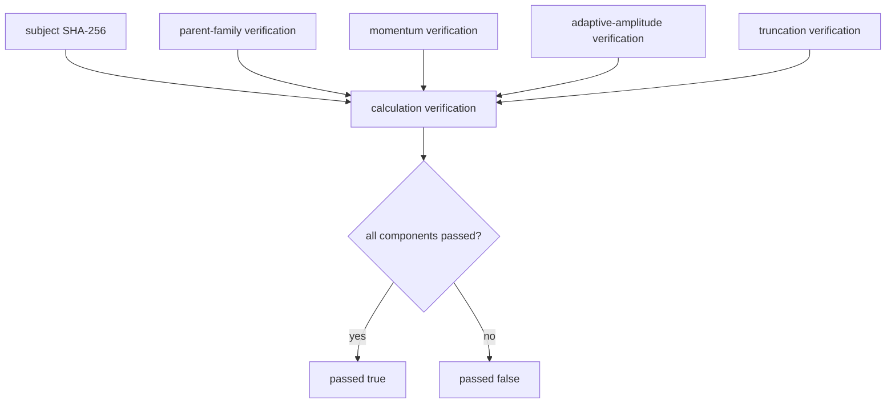

# Schematic

```mermaid
flowchart TD
    H[subject SHA-256] --> V[calculation verification]
    F[parent-family verification] --> V
    M[momentum verification] --> V
    A[adaptive-amplitude verification] --> V
    T[truncation verification] --> V
    V --> P{all components passed?}
    P -->|yes| Y[passed true]
    P -->|no| N[passed false]
```
