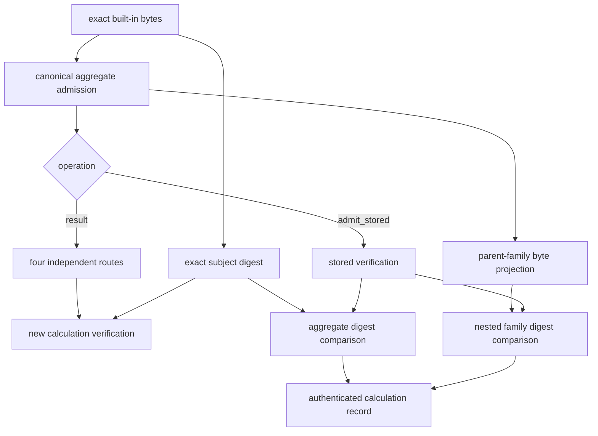

# Schematic

```mermaid
flowchart TD
    B[exact built-in bytes] --> A[canonical aggregate admission]
    A --> Q{operation}
    Q -->|result| I[four independent routes]
    I --> V[new calculation verification]
    B --> H[exact subject digest]
    H --> V
    Q -->|admit_stored| S[stored verification]
    H --> D[aggregate digest comparison]
    S --> D
    A --> F[parent-family byte projection]
    F --> G[nested family digest comparison]
    S --> G
    D --> R[authenticated calculation record]
    G --> R
```
