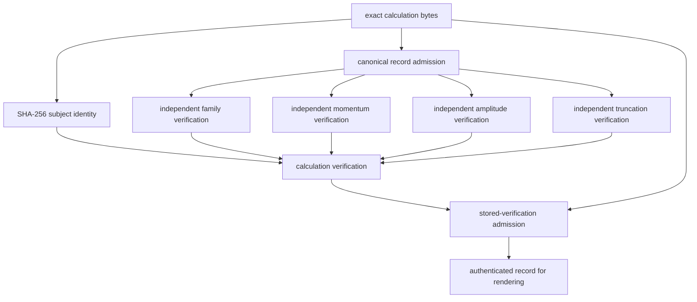

# Schematic

```mermaid
flowchart TD
    B[exact calculation bytes] --> C[canonical record admission]
    B --> H[SHA-256 subject identity]
    C --> F[independent family verification]
    C --> M[independent momentum verification]
    C --> A[independent amplitude verification]
    C --> T[independent truncation verification]
    H --> V[calculation verification]
    F --> V
    M --> V
    A --> V
    T --> V
    V --> S[stored-verification admission]
    B --> S
    S --> R[authenticated record for rendering]
```
