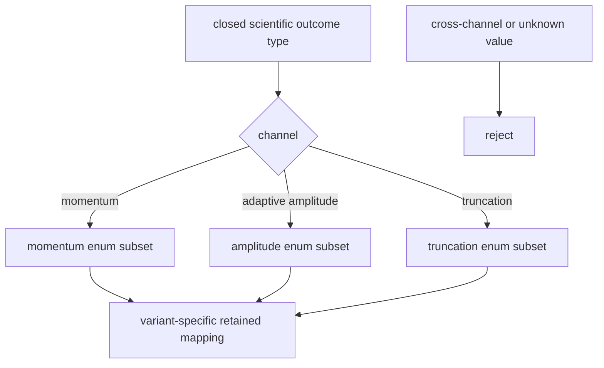

# Schematic

```mermaid
flowchart TD
    O[closed scientific outcome type] --> C{channel}
    C -->|momentum| M[momentum enum subset]
    C -->|adaptive amplitude| A[amplitude enum subset]
    C -->|truncation| T[truncation enum subset]
    M --> W[variant-specific retained mapping]
    A --> W
    T --> W
    X[cross-channel or unknown value] --> R[reject]
```
