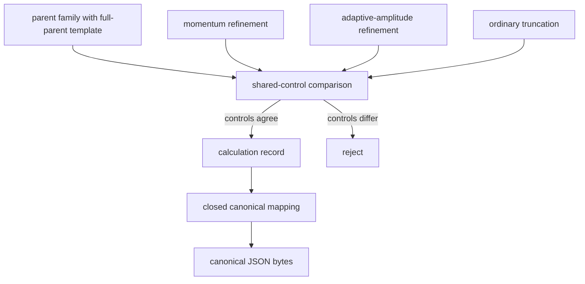

# Schematic

```mermaid
flowchart TD
    PF[parent family with full-parent template] --> K[shared-control comparison]
    MR[momentum refinement] --> K
    AR[adaptive-amplitude refinement] --> K
    TR[ordinary truncation] --> K
    K -->|controls agree| R[calculation record]
    K -->|controls differ| X[reject]
    R --> M[closed canonical mapping]
    M --> B[canonical JSON bytes]
```
