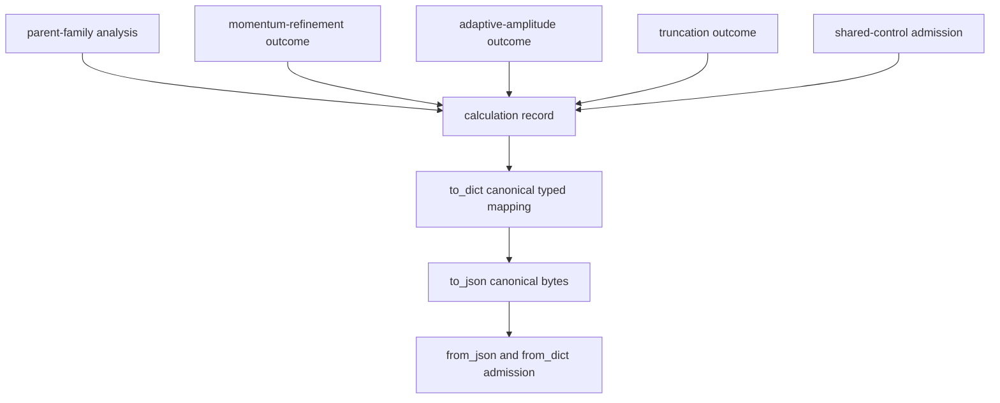

# Schematic

```mermaid
flowchart TD
    F[parent-family analysis] --> R[calculation record]
    M[momentum-refinement outcome] --> R
    A[adaptive-amplitude outcome] --> R
    T[truncation outcome] --> R
    C[shared-control admission] --> R
    R --> D[to_dict canonical typed mapping]
    D --> J[to_json canonical bytes]
    J --> P[from_json and from_dict admission]
```
