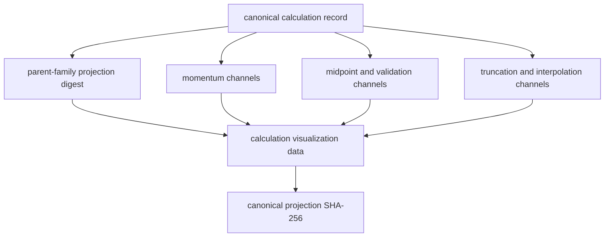

# Schematic

```mermaid
flowchart TD
    C[canonical calculation record] --> F[parent-family projection digest]
    C --> M[momentum channels]
    C --> A[midpoint and validation channels]
    C --> T[truncation and interpolation channels]
    F --> D[calculation visualization data]
    M --> D
    A --> D
    T --> D
    D --> H[canonical projection SHA-256]
```
