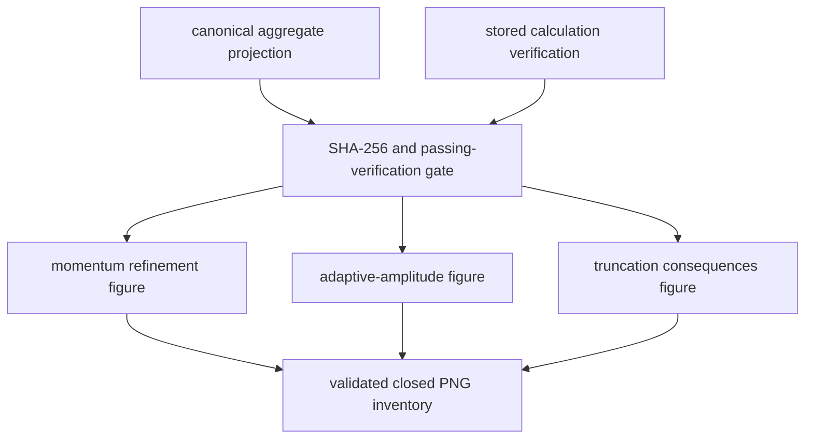

# Schematic

```mermaid
flowchart TD
    D[canonical aggregate projection] --> G[SHA-256 and passing-verification gate]
    V[stored calculation verification] --> G
    G --> M[momentum refinement figure]
    G --> A[adaptive-amplitude figure]
    G --> T[truncation consequences figure]
    M --> P[validated closed PNG inventory]
    A --> P
    T --> P
```
