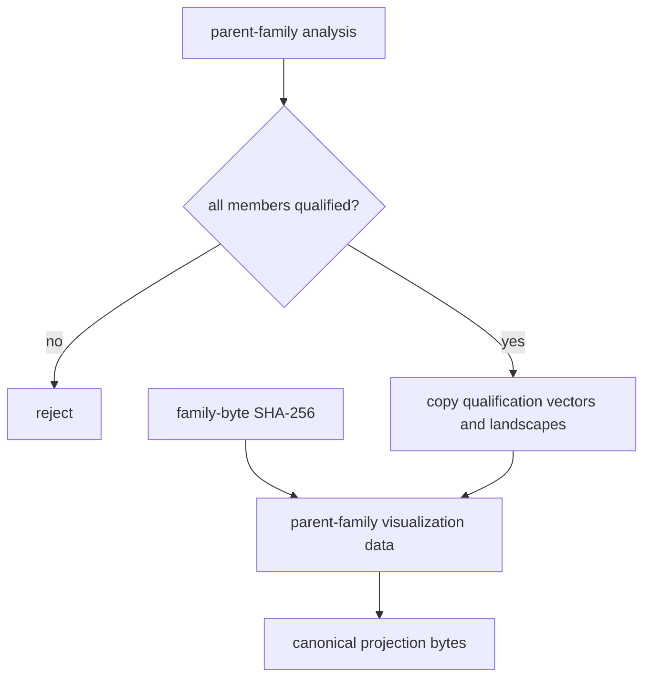

# Schematic

```mermaid
flowchart TD
    F[parent-family analysis] --> Q{all members qualified?}
    Q -->|no| X[reject]
    Q -->|yes| P[copy qualification vectors and landscapes]
    H[family-byte SHA-256] --> D[parent-family visualization data]
    P --> D
    D --> J[canonical projection bytes]
```
