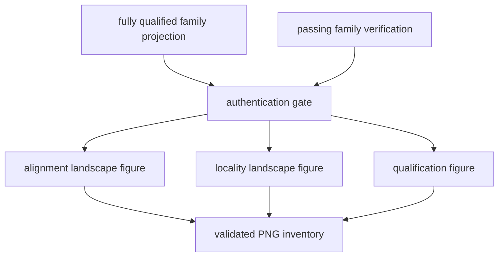

# Schematic

```mermaid
flowchart TD
    D[fully qualified family projection] --> G[authentication gate]
    V[passing family verification] --> G
    G --> A[alignment landscape figure]
    G --> L[locality landscape figure]
    G --> Q[qualification figure]
    A --> P[validated PNG inventory]
    L --> P
    Q --> P
```
