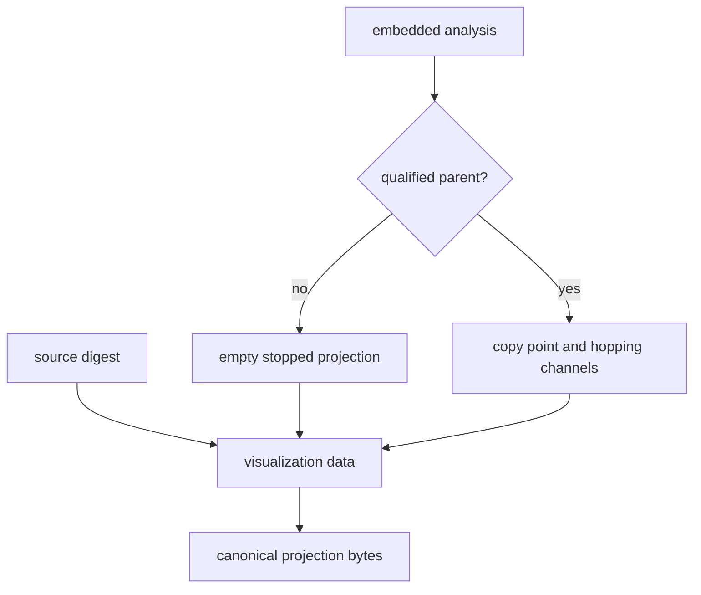

# Schematic

```mermaid
flowchart TD
    A[embedded analysis] --> Q{qualified parent?}
    H[source digest] --> P[visualization data]
    Q -->|no| E[empty stopped projection]
    Q -->|yes| C[copy point and hopping channels]
    E --> P
    C --> P
    P --> J[canonical projection bytes]
```
