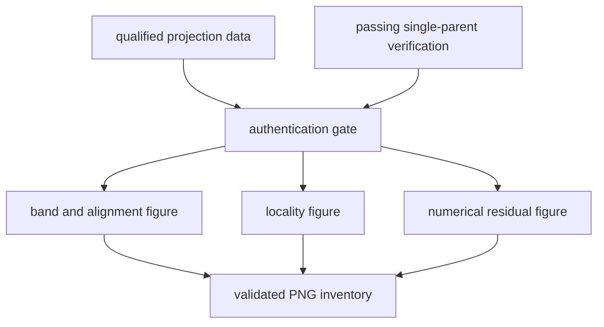

# Schematic

```mermaid
flowchart TD
    D[qualified projection data] --> G[authentication gate]
    V[passing single-parent verification] --> G
    G --> B[band and alignment figure]
    G --> L[locality figure]
    G --> N[numerical residual figure]
    B --> P[validated PNG inventory]
    L --> P
    N --> P
```
