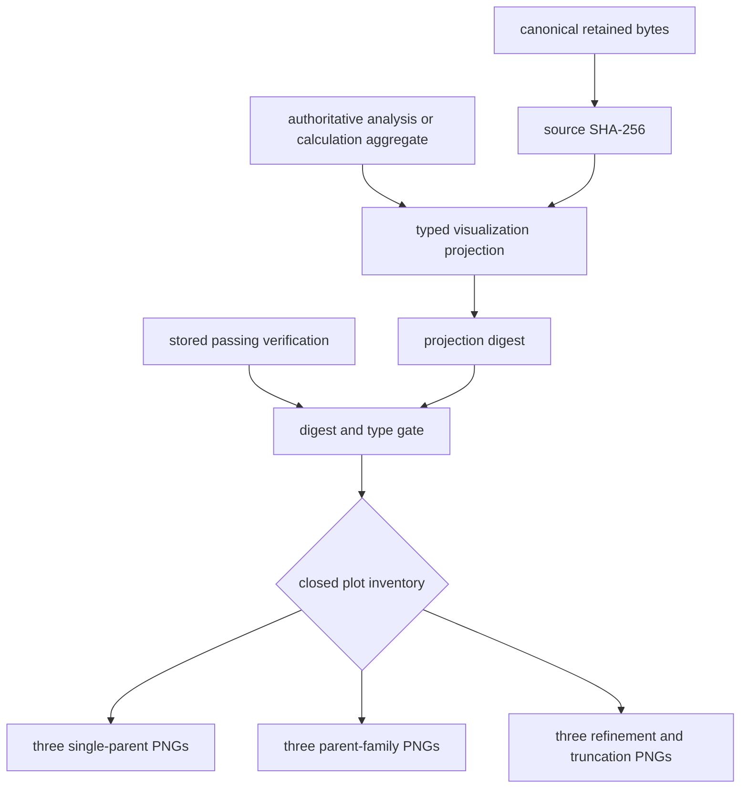

# Schematic

```mermaid
flowchart TD
    A[authoritative analysis or calculation aggregate] --> P[typed visualization projection]
    B[canonical retained bytes] --> H[source SHA-256]
    H --> P
    P --> D[projection digest]
    V[stored passing verification] --> G[digest and type gate]
    D --> G
    G --> I{closed plot inventory}
    I --> S[three single-parent PNGs]
    I --> F[three parent-family PNGs]
    I --> C[three refinement and truncation PNGs]
```
