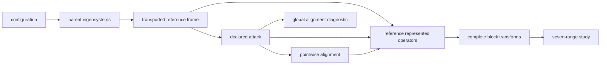

# Schematic

```mermaid
flowchart LR
    C[configuration] --> E[parent eigensystems]
    E --> T[transported reference frame]
    T --> A[declared attack]
    A --> P[pointwise alignment]
    A --> G[global alignment diagnostic]
    T --> O[reference represented operators]
    A --> O
    P --> O
    O --> F[complete block transforms]
    F --> R[seven-range study]
```
