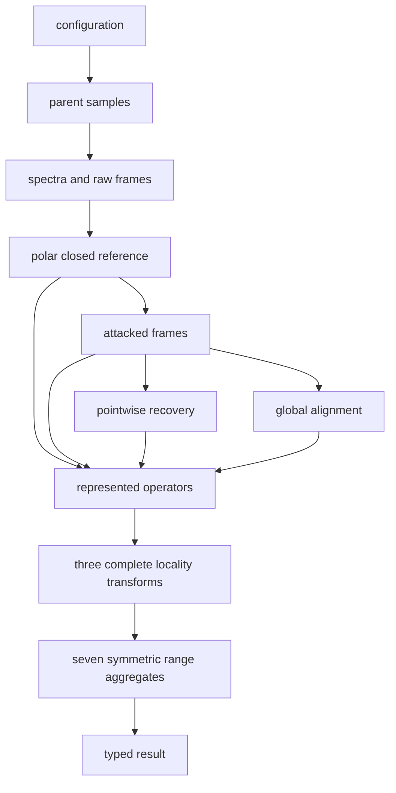

# Analysis schematic

```mermaid
flowchart TD
    C[configuration] --> H[parent samples]
    H --> S[spectra and raw frames]
    S --> F[polar closed reference]
    F --> A[attacked frames]
    A --> P[pointwise recovery]
    A --> G[global alignment]
    F --> O[represented operators]
    A --> O
    P --> O
    G --> O
    O --> T[three complete locality transforms]
    T --> R[seven symmetric range aggregates]
    R --> Q[typed result]
```
