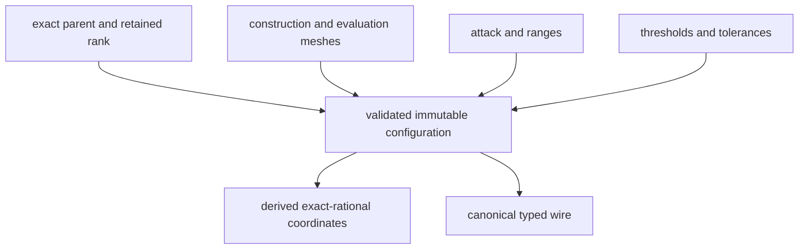

# Schematic

```mermaid
flowchart TD
    P[exact parent and retained rank] --> C[validated immutable configuration]
    M[construction and evaluation meshes] --> C
    A[attack and ranges] --> C
    T[thresholds and tolerances] --> C
    C --> D[derived exact-rational coordinates]
    C --> W[canonical typed wire]
```
