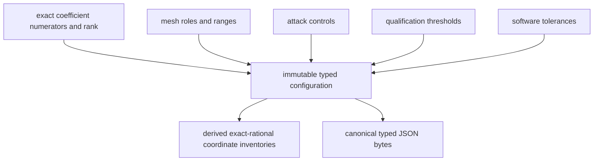

# Configuration schematic

```mermaid
flowchart TD
    P[exact coefficient numerators and rank] --> C[immutable typed configuration]
    M[mesh roles and ranges] --> C
    A[attack controls] --> C
    Q[qualification thresholds] --> C
    S[software tolerances] --> C
    C --> D[derived exact-rational coordinate inventories]
    C --> J[canonical typed JSON bytes]
```
