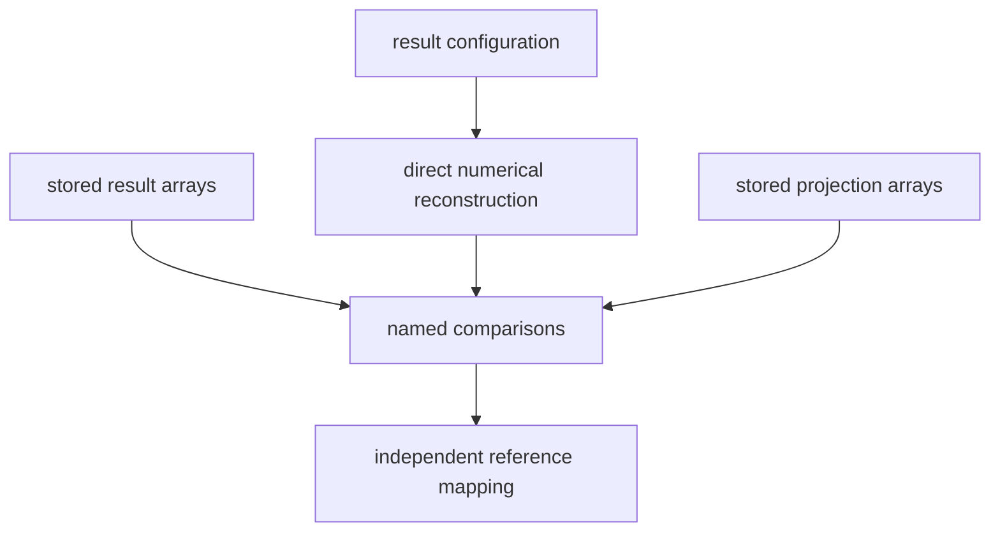

# Schematic

```mermaid
flowchart TD
    C[result configuration] --> R[direct numerical reconstruction]
    S[stored result arrays] --> K[named comparisons]
    R --> K
    P[stored projection arrays] --> K
    K --> V[independent reference mapping]
```
