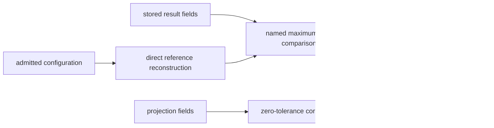

# Independent reconstruction schematic

```mermaid
flowchart LR
    C[admitted configuration] --> R[direct reference reconstruction]
    S[stored result fields] --> E[named maximum-error comparisons]
    R --> E
    P[projection fields] --> Z[zero-tolerance correlations]
    E --> M[immutable collision-free comparison mapping]
    Z --> M
```
