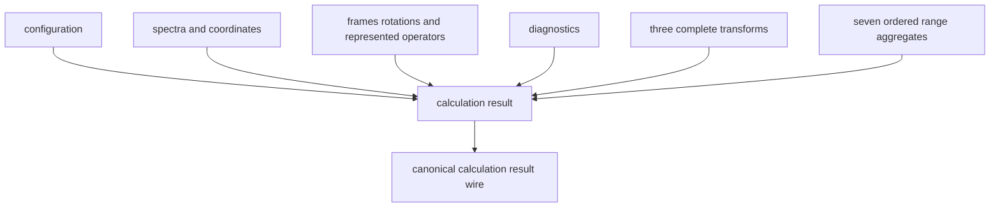

# Schematic

```mermaid
flowchart TD
    C[configuration] --> R[calculation result]
    S[spectra and coordinates] --> R
    F[frames rotations and represented operators] --> R
    D[diagnostics] --> R
    T[three complete transforms] --> R
    G[seven ordered range aggregates] --> R
    R --> W[canonical calculation result wire]
```
