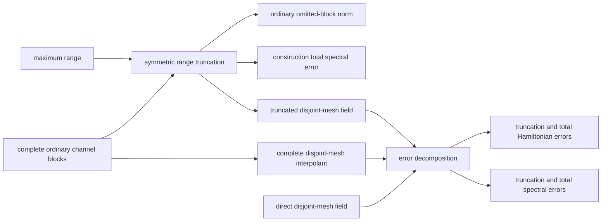

# Schematic

```mermaid
flowchart LR
    B[complete ordinary channel blocks] --> T[symmetric range truncation]
    R[maximum range] --> T
    T --> O[ordinary omitted-block norm]
    T --> C[construction total spectral error]
    B --> U[complete disjoint-mesh interpolant]
    T --> V[truncated disjoint-mesh field]
    D[direct disjoint-mesh field] --> E[error decomposition]
    U --> E
    V --> E
    E --> H[truncation and total Hamiltonian errors]
    E --> S[truncation and total spectral errors]
```
