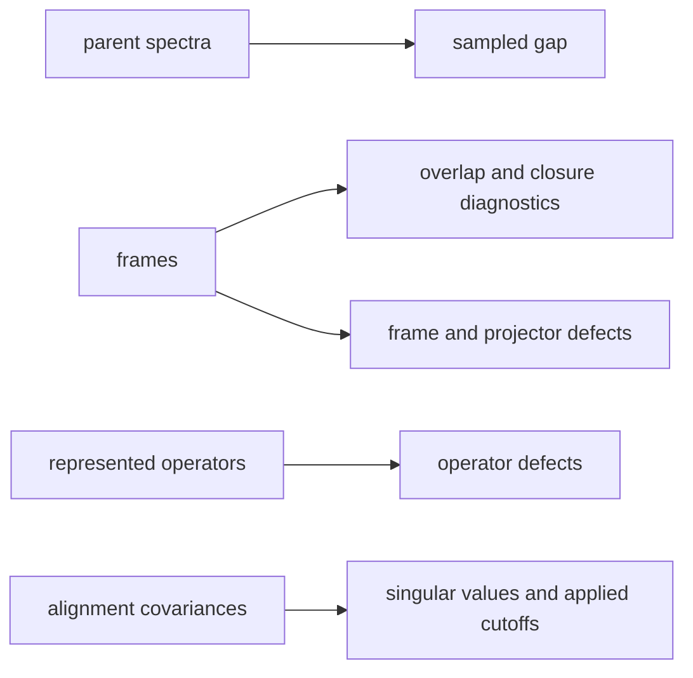

# Schematic

```mermaid
flowchart LR
    P[parent spectra] --> G[sampled gap]
    F[frames] --> O[overlap and closure diagnostics]
    F --> D[frame and projector defects]
    H[represented operators] --> R[operator defects]
    C[alignment covariances] --> S[singular values and applied cutoffs]
```
