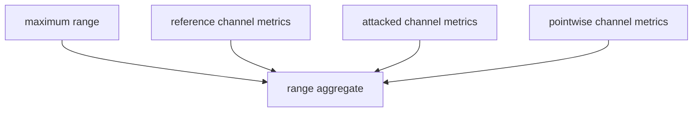

# Schematic

```mermaid
flowchart TD
    R[maximum range] --> A[range aggregate]
    E[reference channel metrics] --> A
    T[attacked channel metrics] --> A
    P[pointwise channel metrics] --> A
```
