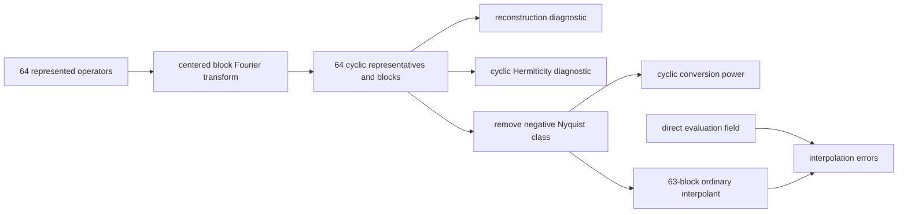

# Schematic

```mermaid
flowchart LR
    O[64 represented operators] --> F[centered block Fourier transform]
    F --> B[64 cyclic representatives and blocks]
    B --> R[reconstruction diagnostic]
    B --> H[cyclic Hermiticity diagnostic]
    B --> N[remove negative Nyquist class]
    N --> P[cyclic conversion power]
    N --> L[63-block ordinary interpolant]
    D[direct evaluation field] --> I[interpolation errors]
    L --> I
```
