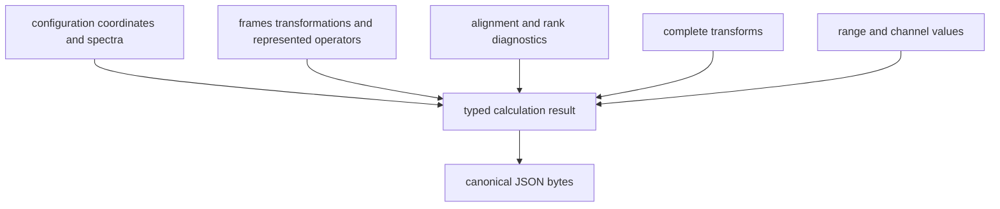

# Result schematic

```mermaid
flowchart TD
    C[configuration coordinates and spectra] --> R[typed calculation result]
    F[frames transformations and represented operators] --> R
    D[alignment and rank diagnostics] --> R
    T[complete transforms] --> R
    G[range and channel values] --> R
    R --> J[canonical JSON bytes]
```
