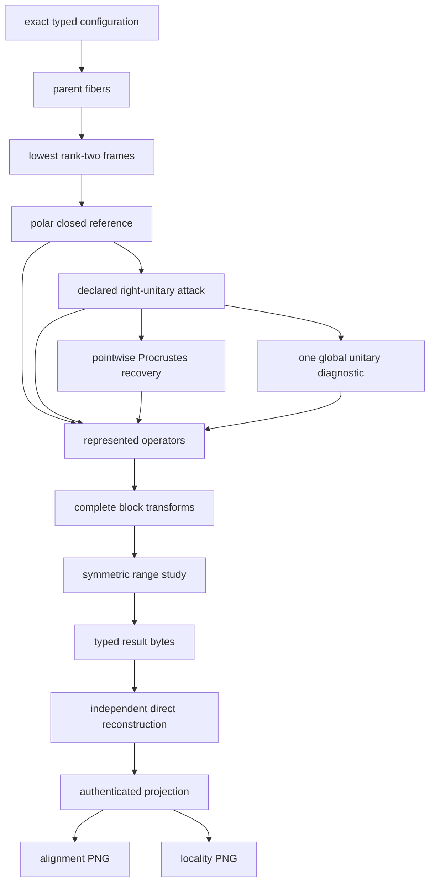

# Composite-band alignment lifecycle schematic

```mermaid
flowchart TD
    C[exact typed configuration] --> P[parent fibers]
    P --> F[lowest rank-two frames]
    F --> R[polar closed reference]
    R --> A[declared right-unitary attack]
    A --> W[pointwise Procrustes recovery]
    A --> G[one global unitary diagnostic]
    R --> O[represented operators]
    A --> O
    W --> O
    G --> O
    O --> T[complete block transforms]
    T --> S[symmetric range study]
    S --> B[typed result bytes]
    B --> V[independent direct reconstruction]
    V --> D[authenticated projection]
    D --> I[alignment PNG]
    D --> L[locality PNG]
```

Direct scripts own filesystem effects and atomic publication. Source actions neither
read nor write retained calculation directories.