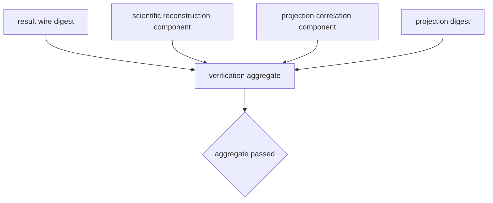

# Schematic

```mermaid
flowchart TD
    H[result wire digest] --> A[verification aggregate]
    S[scientific reconstruction component] --> A
    P[projection correlation component] --> A
    D[projection digest] --> A
    A --> R{aggregate passed}
```
