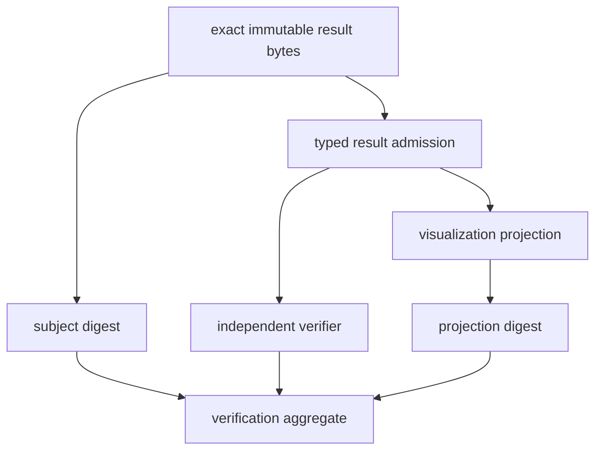

# Schematic

```mermaid
flowchart TD
    B[exact immutable result bytes] --> H[subject digest]
    B --> R[typed result admission]
    R --> I[independent verifier]
    R --> P[visualization projection]
    P --> D[projection digest]
    H --> A[verification aggregate]
    I --> A
    D --> A
```
