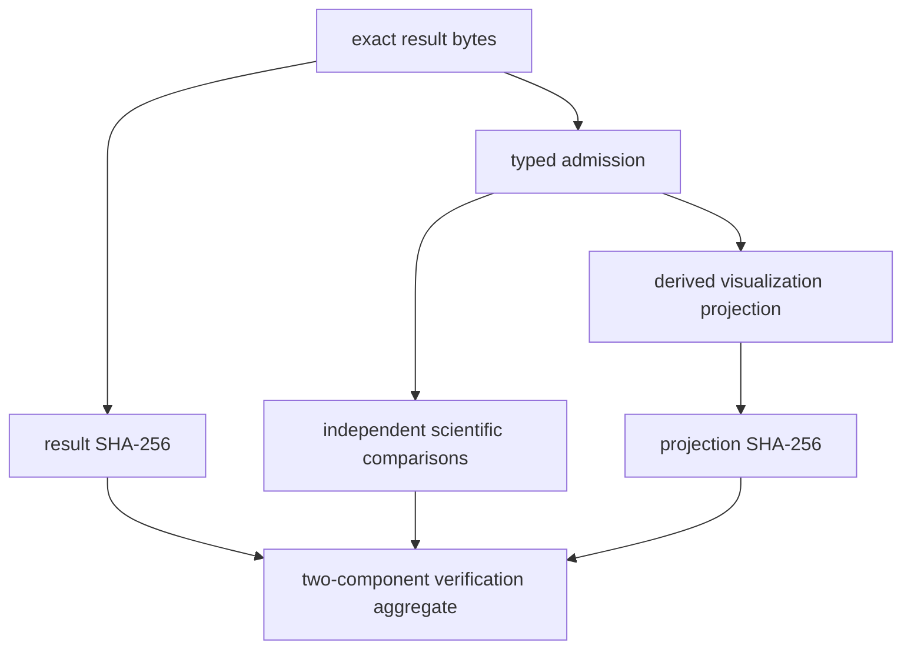

# Verification schematic

```mermaid
flowchart TD
    B[exact result bytes] --> H[result SHA-256]
    B --> A[typed admission]
    A --> S[independent scientific comparisons]
    A --> P[derived visualization projection]
    P --> D[projection SHA-256]
    H --> V[two-component verification aggregate]
    S --> V
    D --> V
```
