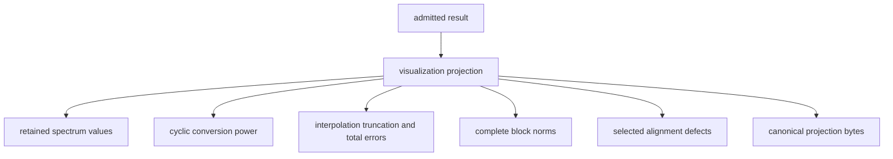

# Schematic

```mermaid
flowchart TD
    R[admitted result] --> P[visualization projection]
    P --> S[retained spectrum values]
    P --> C[cyclic conversion power]
    P --> E[interpolation truncation and total errors]
    P --> H[complete block norms]
    P --> D[selected alignment defects]
    P --> W[canonical projection bytes]
```
