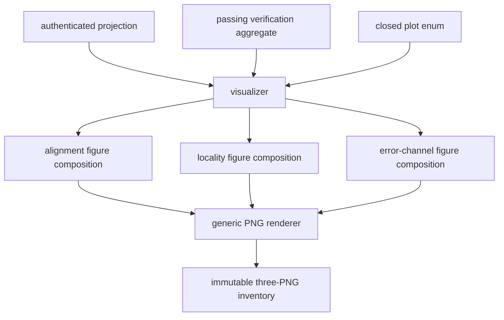

# Schematic

```mermaid
flowchart TD
    P[authenticated projection] --> V[visualizer]
    Q[passing verification aggregate] --> V
    E[closed plot enum] --> V
    V --> A[alignment figure composition]
    V --> L[locality figure composition]
    V --> C[error-channel figure composition]
    A --> R[generic PNG renderer]
    L --> R
    C --> R
    R --> I[immutable three-PNG inventory]
```
