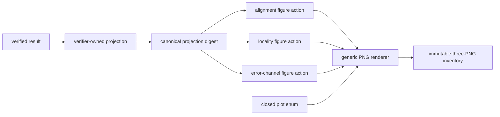

# Visualization schematic

```mermaid
flowchart LR
    R[verified result] --> P[verifier-owned projection]
    P --> D[canonical projection digest]
    D --> A[alignment figure action]
    D --> L[locality figure action]
    D --> C[error-channel figure action]
    A --> G[generic PNG renderer]
    L --> G
    C --> G
    E[closed plot enum] --> G
    G --> I[immutable three-PNG inventory]
```
