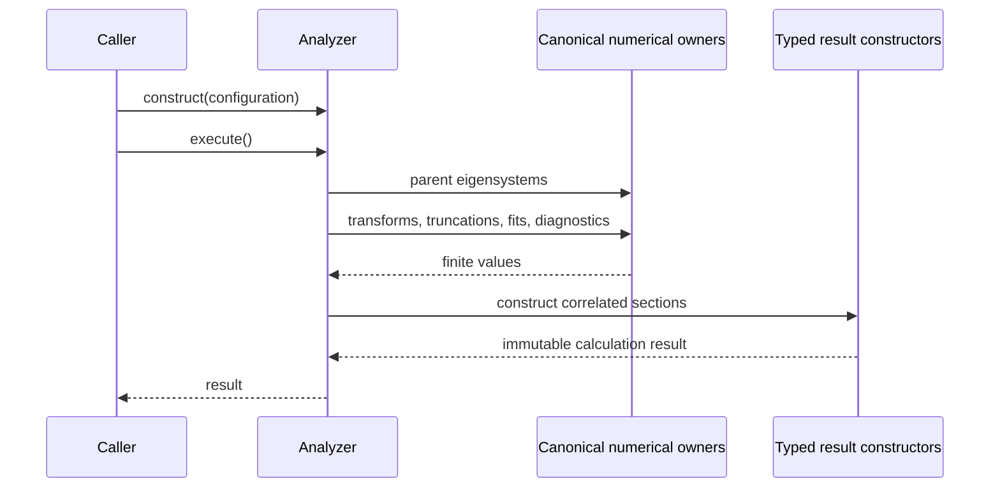
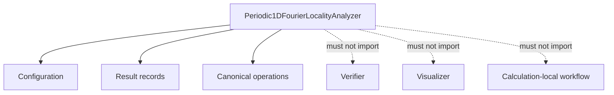

# `Periodic1DFourierLocalityAnalyzer` schematics

## Public operation

```mermaid
sequenceDiagram
    participant Caller
    participant Analyzer
    participant Owners as Canonical numerical owners
    participant Records as Typed result constructors

    Caller->>Analyzer: construct(configuration)
    Caller->>Analyzer: execute()
    Analyzer->>Owners: parent eigensystems
    Analyzer->>Owners: transforms, truncations, fits, diagnostics
    Owners-->>Analyzer: finite values
    Analyzer->>Records: construct correlated sections
    Records-->>Analyzer: immutable calculation result
    Analyzer-->>Caller: result
```

## Prohibited dependencies

```mermaid
flowchart TB
    A[Periodic1DFourierLocalityAnalyzer]
    A --> C[Configuration]
    A --> R[Result records]
    A --> O[Canonical operations]
    A -. must not import .-> V[Verifier]
    A -. must not import .-> Z[Visualizer]
    A -. must not import .-> W[Calculation-local workflow]
```
