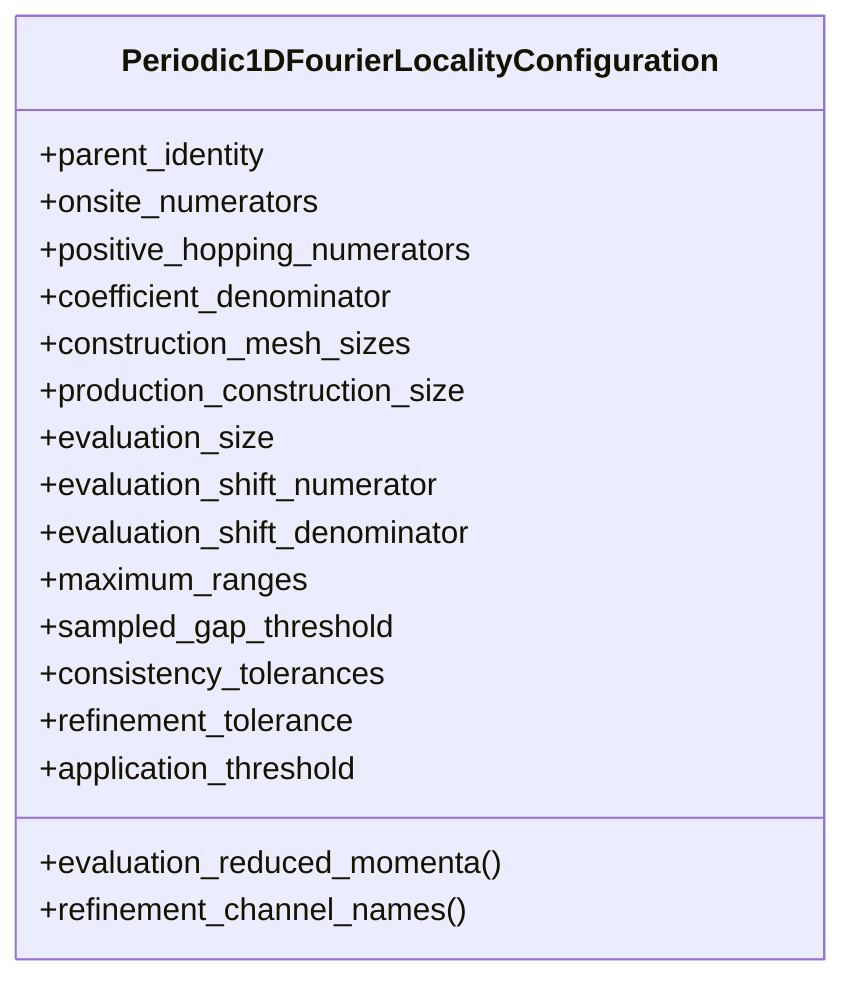
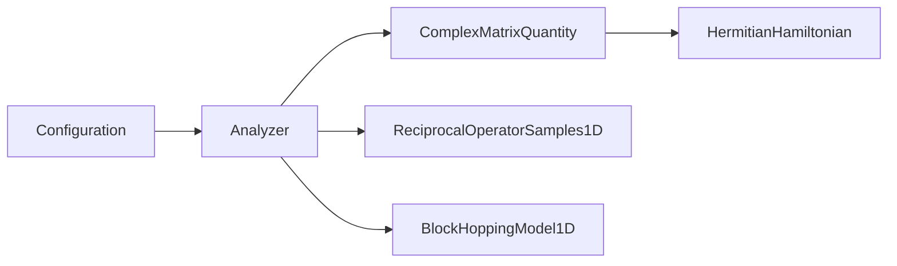
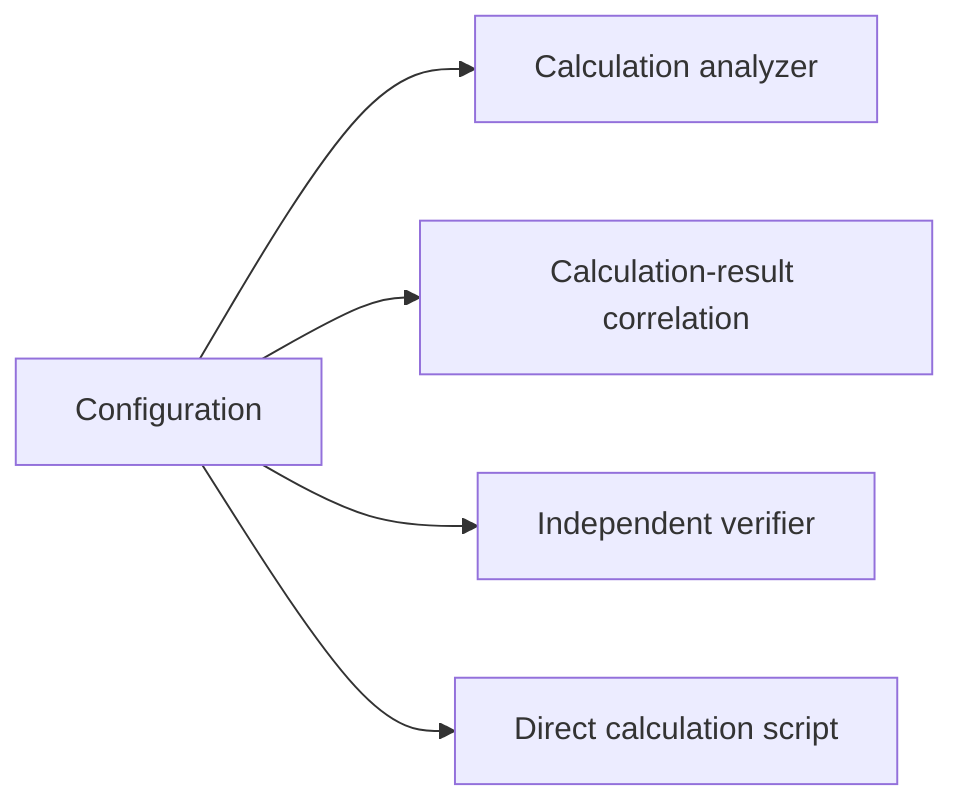

# `Periodic1DFourierLocalityConfiguration` schematics

## Record fields

```mermaid
classDiagram
    class Periodic1DFourierLocalityConfiguration {
        +parent_identity
        +onsite_numerators
        +positive_hopping_numerators
        +coefficient_denominator
        +construction_mesh_sizes
        +production_construction_size
        +evaluation_size
        +evaluation_shift_numerator
        +evaluation_shift_denominator
        +maximum_ranges
        +sampled_gap_threshold
        +consistency_tolerances
        +refinement_tolerance
        +application_threshold
        +evaluation_reduced_momenta()
        +refinement_channel_names()
    }
```

## Separation from runtime objects

```mermaid
flowchart LR
    C[Configuration] --> A[Analyzer]
    A --> CMQ[ComplexMatrixQuantity]
    CMQ --> HH[HermitianHamiltonian]
    A --> ROS[ReciprocalOperatorSamples1D]
    A --> BHM[BlockHoppingModel1D]
```

The analyzer, not the configuration, owns runtime object construction.

## Consumers

```mermaid
flowchart LR
    C[Configuration]
    C --> A[Calculation analyzer]
    C --> R[Calculation-result correlation]
    C --> V[Independent verifier]
    C --> D[Direct calculation script]
```
