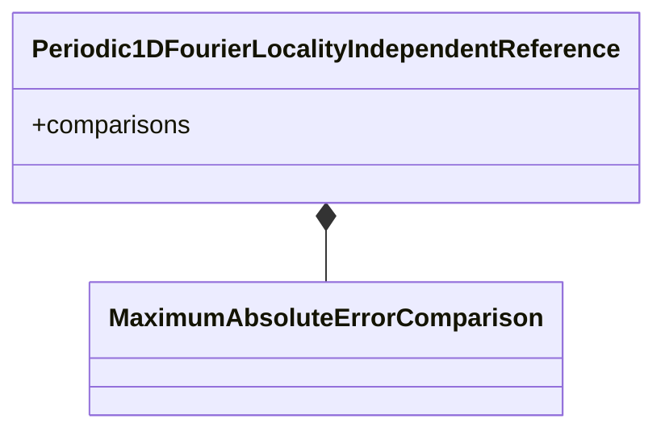
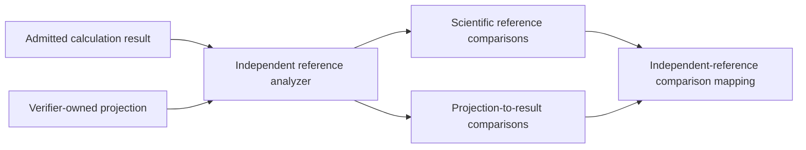

# `Periodic1DFourierLocalityIndependentReference` schematics

```mermaid
classDiagram
    class Periodic1DFourierLocalityIndependentReference {
        +comparisons
    }
    class MaximumAbsoluteErrorComparison
    Periodic1DFourierLocalityIndependentReference *-- MaximumAbsoluteErrorComparison
```

```mermaid
flowchart LR
    R[Admitted calculation result] --> I[Independent reference analyzer]
    P[Verifier-owned projection] --> I
    I --> S[Scientific reference comparisons]
    I --> V[Projection-to-result comparisons]
    S --> X[Independent-reference comparison mapping]
    V --> X
```
