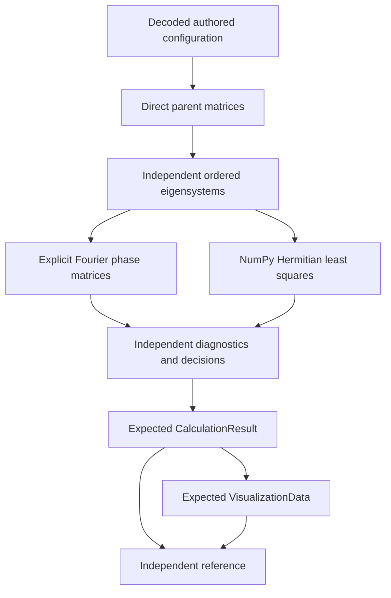
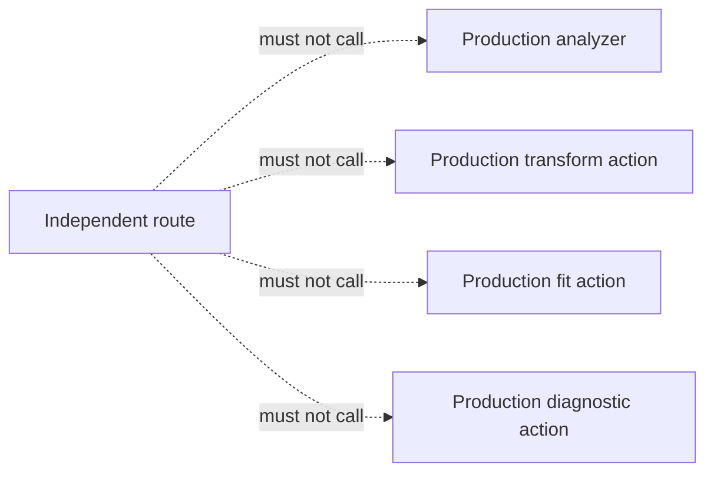

# Independent-verification-value schematics

```mermaid
flowchart TB
    C[Decoded authored configuration] --> P[Direct parent matrices]
    P --> E[Independent ordered eigensystems]
    E --> F[Explicit Fourier phase matrices]
    E --> L[NumPy Hermitian least squares]
    F --> D[Independent diagnostics and decisions]
    L --> D
    D --> R[Expected CalculationResult]
    R --> V[Expected VisualizationData]
    R --> I[Independent reference]
    V --> I
```

```mermaid
flowchart LR
    I[Independent route]
    I -. must not call .-> A[Production analyzer]
    I -. must not call .-> T[Production transform action]
    I -. must not call .-> F[Production fit action]
    I -. must not call .-> D[Production diagnostic action]
```

Record constructors remain shared because they define the wire and invariants being
verified, not the numerical route producing values.
