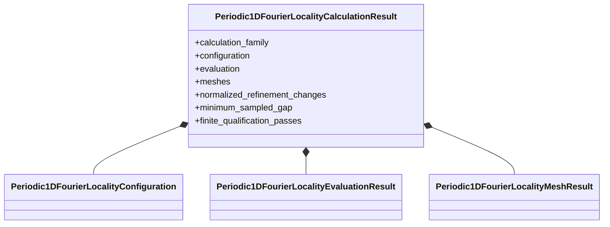
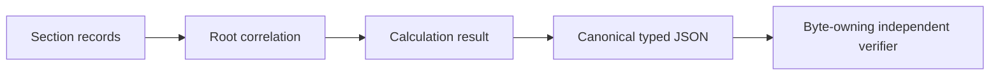

# `Periodic1DFourierLocalityCalculationResult` schematics

```mermaid
classDiagram
    class Periodic1DFourierLocalityCalculationResult {
        +calculation_family
        +configuration
        +evaluation
        +meshes
        +normalized_refinement_changes
        +minimum_sampled_gap
        +finite_qualification_passes
    }
    class Periodic1DFourierLocalityConfiguration
    class Periodic1DFourierLocalityEvaluationResult
    class Periodic1DFourierLocalityMeshResult

    Periodic1DFourierLocalityCalculationResult *-- Periodic1DFourierLocalityConfiguration
    Periodic1DFourierLocalityCalculationResult *-- Periodic1DFourierLocalityEvaluationResult
    Periodic1DFourierLocalityCalculationResult *-- Periodic1DFourierLocalityMeshResult
```

```mermaid
flowchart LR
    S[Section records] --> C[Root correlation]
    C --> R[Calculation result]
    R --> J[Canonical typed JSON]
    J --> V[Byte-owning independent verifier]
```
