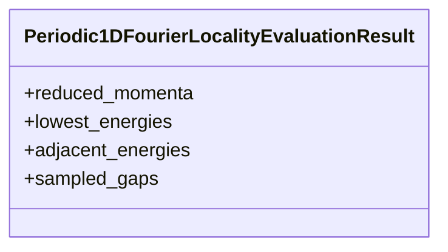
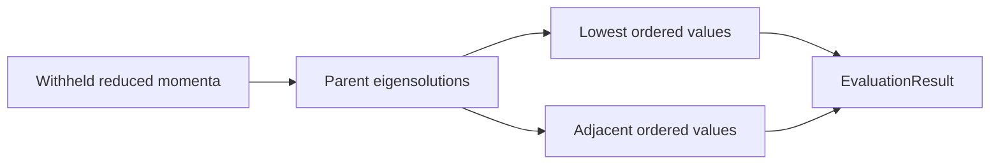

# `Periodic1DFourierLocalityEvaluationResult` schematics

```mermaid
classDiagram
    class Periodic1DFourierLocalityEvaluationResult {
        +reduced_momenta
        +lowest_energies
        +adjacent_energies
        +sampled_gaps
    }
```

```mermaid
flowchart LR
    K[Withheld reduced momenta] --> E[Parent eigensolutions]
    E --> L[Lowest ordered values]
    E --> A[Adjacent ordered values]
    L --> R[EvaluationResult]
    A --> R
```

Approximation candidates belong to mesh and range records, not this authoritative
sample section.
