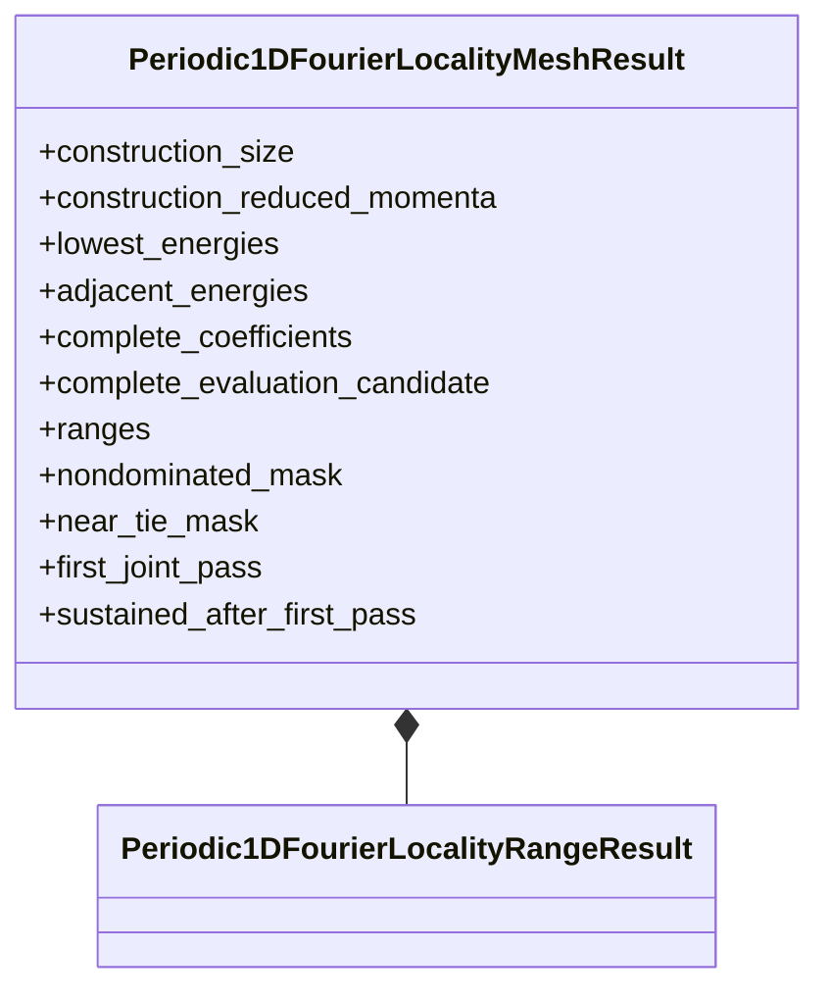
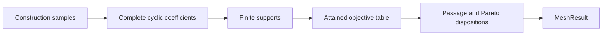

# `Periodic1DFourierLocalityMeshResult` schematics

```mermaid
classDiagram
    class Periodic1DFourierLocalityMeshResult {
        +construction_size
        +construction_reduced_momenta
        +lowest_energies
        +adjacent_energies
        +complete_coefficients
        +complete_evaluation_candidate
        +ranges
        +nondominated_mask
        +near_tie_mask
        +first_joint_pass
        +sustained_after_first_pass
    }
    class Periodic1DFourierLocalityRangeResult
    Periodic1DFourierLocalityMeshResult *-- Periodic1DFourierLocalityRangeResult
```

```mermaid
flowchart LR
    C[Construction samples] --> T[Complete cyclic coefficients]
    T --> F[Finite supports]
    F --> O[Attained objective table]
    O --> P[Passage and Pareto dispositions]
    P --> M[MeshResult]
```
