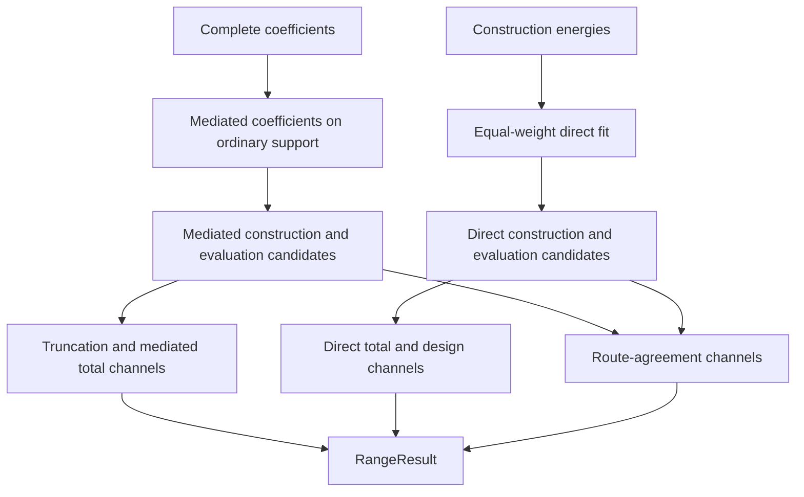
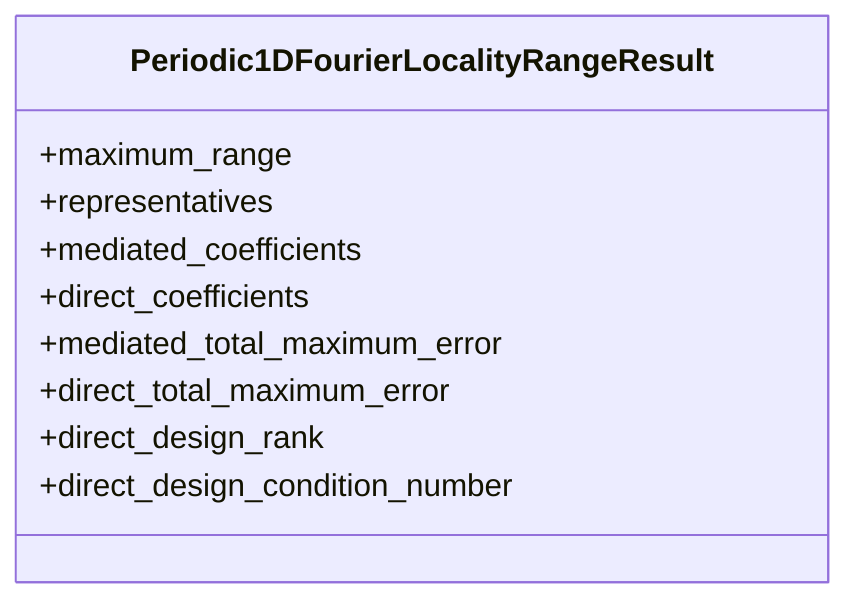

# `Periodic1DFourierLocalityRangeResult` schematics

```mermaid
flowchart TB
    T[Complete coefficients] --> M[Mediated coefficients on ordinary support]
    H[Construction energies] --> F[Equal-weight direct fit]
    M --> MC[Mediated construction and evaluation candidates]
    F --> DC[Direct construction and evaluation candidates]
    MC --> E[Truncation and mediated total channels]
    DC --> D[Direct total and design channels]
    MC --> A[Route-agreement channels]
    DC --> A
    E --> R[RangeResult]
    D --> R
    A --> R
```

```mermaid
classDiagram
    class Periodic1DFourierLocalityRangeResult {
        +maximum_range
        +representatives
        +mediated_coefficients
        +direct_coefficients
        +mediated_total_maximum_error
        +direct_total_maximum_error
        +direct_design_rank
        +direct_design_condition_number
    }
```
