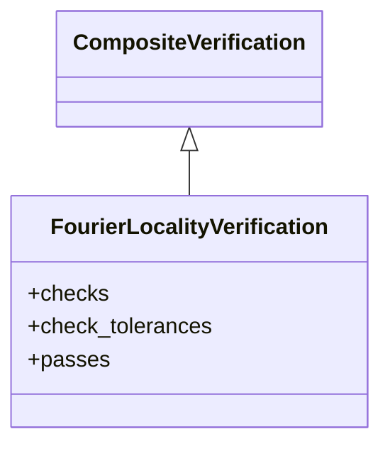
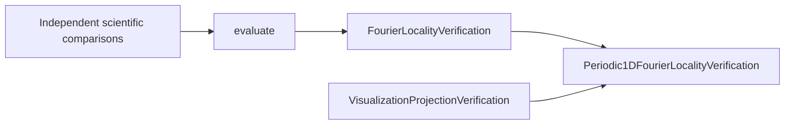

# `FourierLocalityVerification` schematics

```mermaid
classDiagram
    class CompositeVerification
    class FourierLocalityVerification {
        +checks
        +check_tolerances
        +passes
    }
    CompositeVerification <|-- FourierLocalityVerification
```

```mermaid
flowchart LR
    C[Independent scientific comparisons] --> E[evaluate]
    E --> F[FourierLocalityVerification]
    F --> A[Periodic1DFourierLocalityVerification]
    P[VisualizationProjectionVerification] --> A
```
