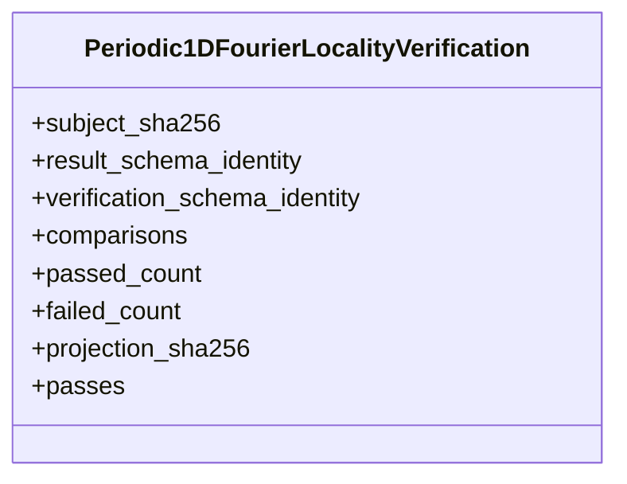
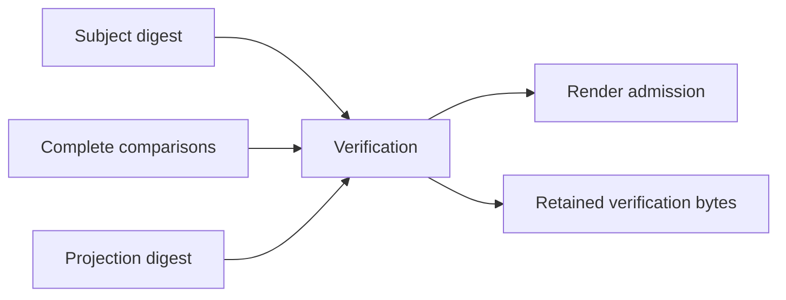

# `Periodic1DFourierLocalityVerification` schematics

```mermaid
classDiagram
    class Periodic1DFourierLocalityVerification {
        +subject_sha256
        +result_schema_identity
        +verification_schema_identity
        +comparisons
        +passed_count
        +failed_count
        +projection_sha256
        +passes
    }
```

```mermaid
flowchart LR
    S[Subject digest] --> V[Verification]
    C[Complete comparisons] --> V
    P[Projection digest] --> V
    V --> R[Render admission]
    V --> E[Retained verification bytes]
```

Rendering additionally requires the supplied projection bytes to reproduce the recorded
projection digest.
