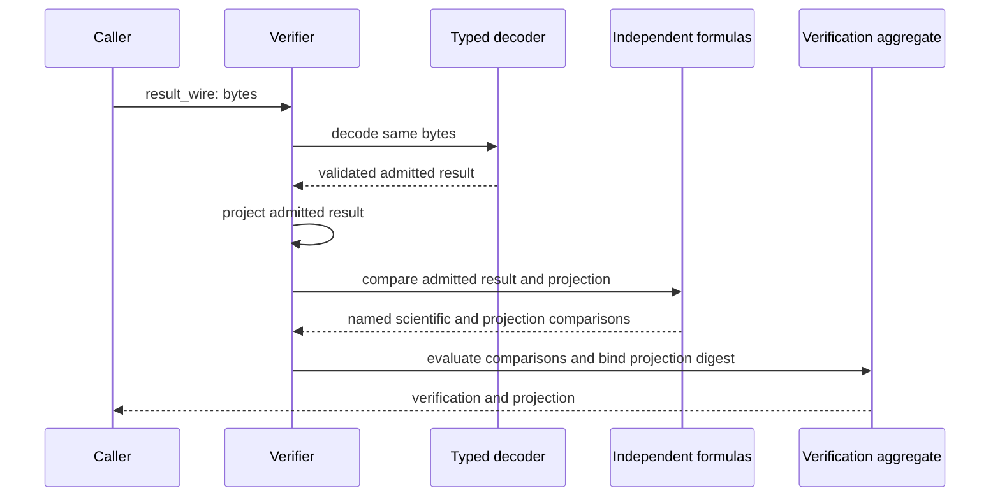
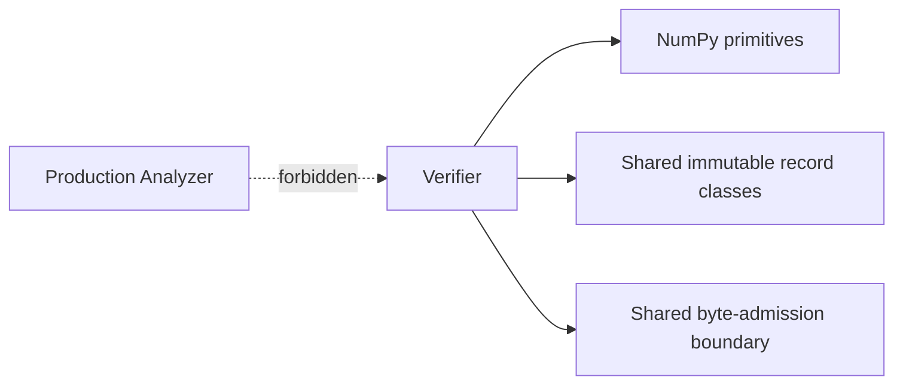

# `Periodic1DFourierLocalityVerifier` schematics

```mermaid
sequenceDiagram
    participant Caller
    participant Verifier
    participant Decoder as Typed decoder
    participant Independent as Independent formulas
    participant Aggregate as Verification aggregate

    Caller->>Verifier: result_wire: bytes
    Verifier->>Decoder: decode same bytes
    Decoder-->>Verifier: validated admitted result
    Verifier->>Verifier: project admitted result
    Verifier->>Independent: compare admitted result and projection
    Independent-->>Verifier: named scientific and projection comparisons
    Verifier->>Aggregate: evaluate comparisons and bind projection digest
    Aggregate-->>Caller: verification and projection
```

```mermaid
flowchart LR
    A[Production Analyzer] -. forbidden .-> V[Verifier]
    V --> N[NumPy primitives]
    V --> R[Shared immutable record classes]
    V --> B[Shared byte-admission boundary]
```
