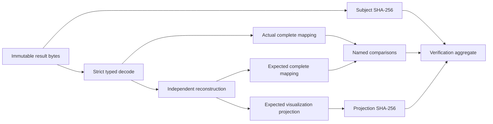
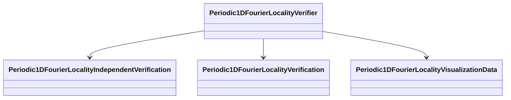
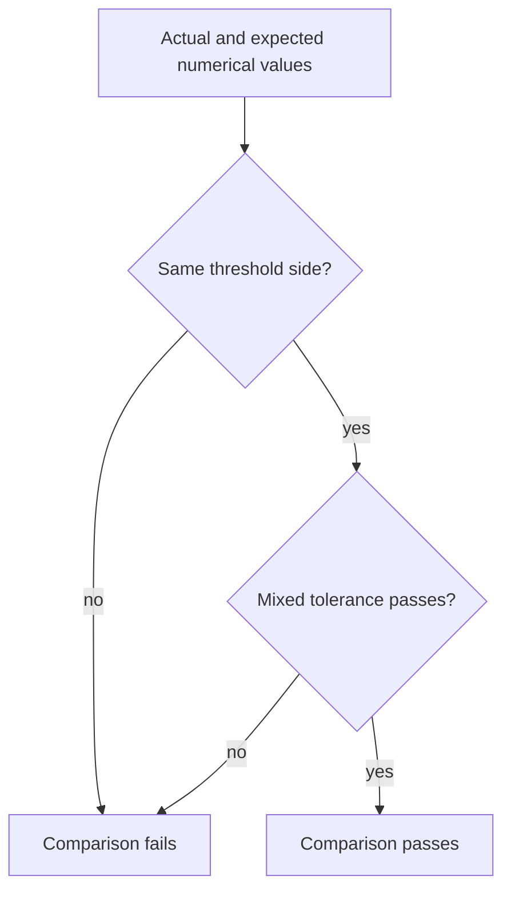

# Verification schematics

## Byte-owning flow

```mermaid
flowchart LR
    B[Immutable result bytes] --> H[Subject SHA-256]
    B --> D[Strict typed decode]
    D --> I[Independent reconstruction]
    D --> C[Actual complete mapping]
    I --> E[Expected complete mapping]
    C --> X[Named comparisons]
    E --> X
    I --> P[Expected visualization projection]
    P --> PH[Projection SHA-256]
    H --> V[Verification aggregate]
    X --> V
    PH --> V
```

## Class relation

```mermaid
classDiagram
    class Periodic1DFourierLocalityVerifier
    class Periodic1DFourierLocalityIndependentVerification
    class Periodic1DFourierLocalityVerification
    class Periodic1DFourierLocalityVisualizationData

    Periodic1DFourierLocalityVerifier --> Periodic1DFourierLocalityIndependentVerification
    Periodic1DFourierLocalityVerifier --> Periodic1DFourierLocalityVerification
    Periodic1DFourierLocalityVerifier --> Periodic1DFourierLocalityVisualizationData
```

## Fail-closed threshold behavior

```mermaid
flowchart TB
    A[Actual and expected numerical values] --> T{Same threshold side?}
    T -- no --> F[Comparison fails]
    T -- yes --> M{Mixed tolerance passes?}
    M -- no --> F
    M -- yes --> P[Comparison passes]
```
