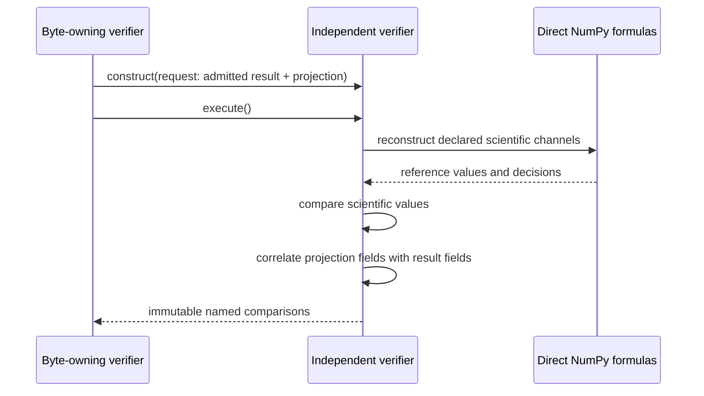
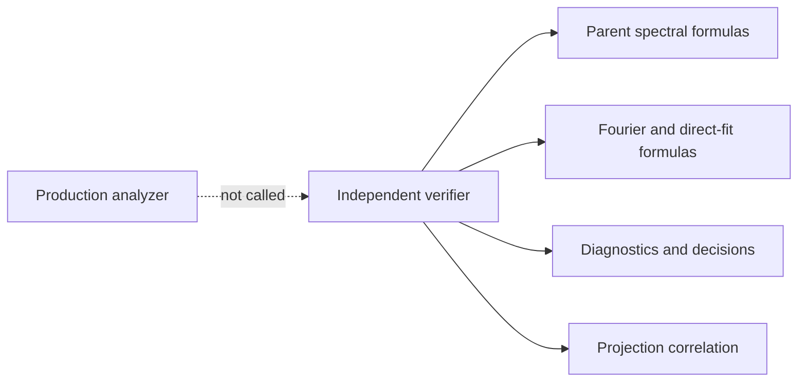

# `Periodic1DFourierLocalityIndependentVerifier` schematics

```mermaid
sequenceDiagram
    participant V as Byte-owning verifier
    participant I as Independent verifier
    participant N as Direct NumPy formulas

    V->>I: construct(request: admitted result + projection)
    V->>I: execute()
    I->>N: reconstruct declared scientific channels
    N-->>I: reference values and decisions
    I->>I: compare scientific values
    I->>I: correlate projection fields with result fields
    I-->>V: immutable named comparisons
```

```mermaid
flowchart LR
    A[Production analyzer] -. not called .-> I[Independent verifier]
    I --> P[Parent spectral formulas]
    I --> F[Fourier and direct-fit formulas]
    I --> D[Diagnostics and decisions]
    I --> C[Projection correlation]
```
