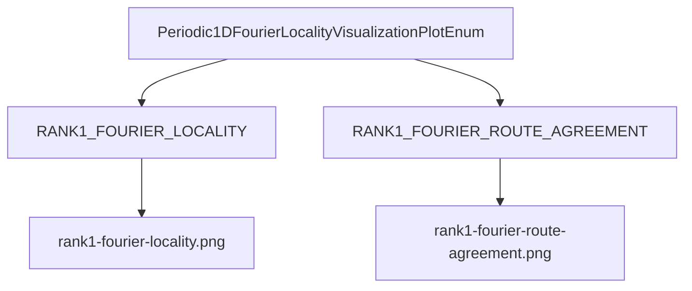
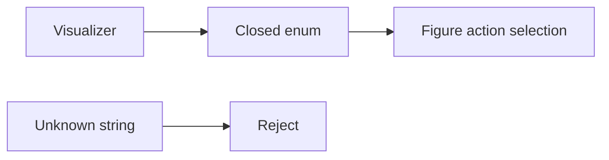

# `Periodic1DFourierLocalityVisualizationPlotEnum` schematics

```mermaid
flowchart TB
    E[Periodic1DFourierLocalityVisualizationPlotEnum]
    E --> L[RANK1_FOURIER_LOCALITY]
    E --> R[RANK1_FOURIER_ROUTE_AGREEMENT]
    L --> LF[rank1-fourier-locality.png]
    R --> RF[rank1-fourier-route-agreement.png]
```

```mermaid
flowchart LR
    V[Visualizer] --> E[Closed enum]
    E --> F[Figure action selection]
    X[Unknown string] --> Z[Reject]
```

No runtime registry can add members.
