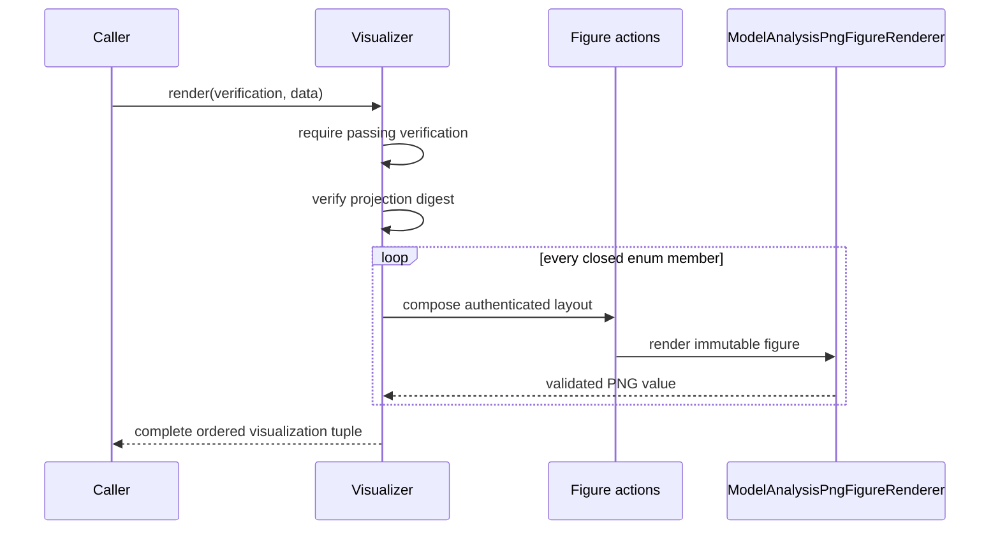
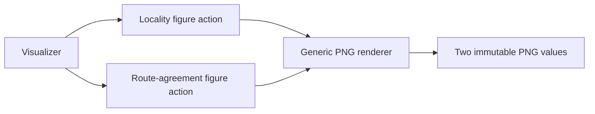

# `Periodic1DFourierLocalityVisualizer` schematics

```mermaid
sequenceDiagram
    participant Caller
    participant Visualizer
    participant Figures as Figure actions
    participant Renderer as ModelAnalysisPngFigureRenderer

    Caller->>Visualizer: render(verification, data)
    Visualizer->>Visualizer: require passing verification
    Visualizer->>Visualizer: verify projection digest
    loop every closed enum member
        Visualizer->>Figures: compose authenticated layout
        Figures->>Renderer: render immutable figure
        Renderer-->>Visualizer: validated PNG value
    end
    Visualizer-->>Caller: complete ordered visualization tuple
```

```mermaid
flowchart LR
    V[Visualizer] --> P1[Locality figure action]
    V --> P2[Route-agreement figure action]
    P1 --> R[Generic PNG renderer]
    P2 --> R
    R --> O[Two immutable PNG values]
```
