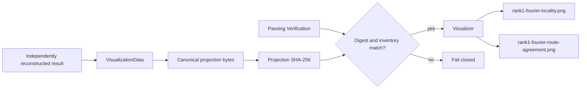
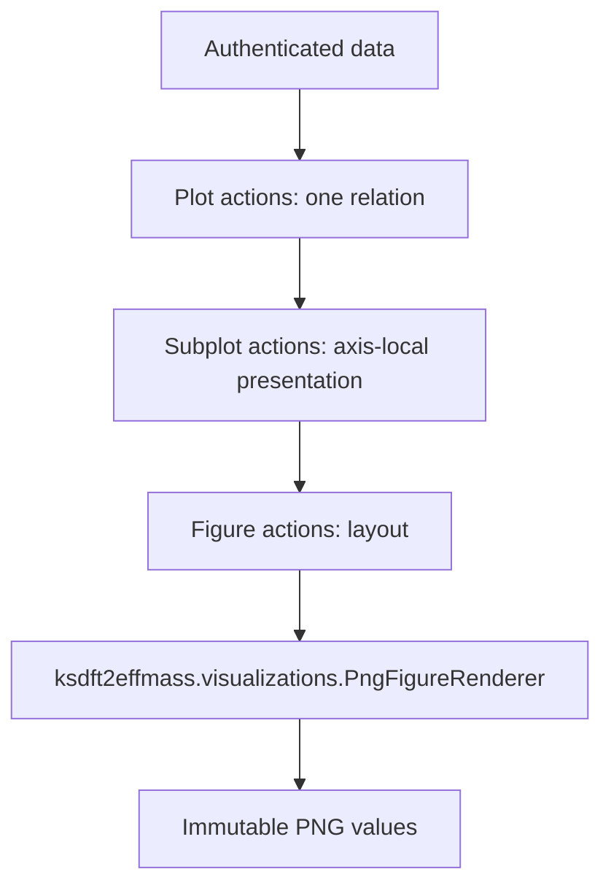
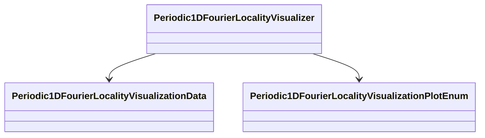

# Visualization schematics

## Authentication and rendering

```mermaid
flowchart LR
    R[Independently reconstructed result] --> D[VisualizationData]
    D --> B[Canonical projection bytes]
    B --> H[Projection SHA-256]
    V[Passing Verification] --> A{Digest and inventory match?}
    H --> A
    A -- yes --> Z[Visualizer]
    A -- no --> F[Fail closed]
    Z --> P1[rank1-fourier-locality.png]
    Z --> P2[rank1-fourier-route-agreement.png]
```

## Presentation ownership

```mermaid
flowchart TB
    D[Authenticated data] --> P[Plot actions: one relation]
    P --> S[Subplot actions: axis-local presentation]
    S --> F[Figure actions: layout]
    F --> G[ksdft2effmass.visualizations.PngFigureRenderer]
    G --> I[Immutable PNG values]
```

## Class relation

```mermaid
classDiagram
    class Periodic1DFourierLocalityVisualizationData
    class Periodic1DFourierLocalityVisualizationPlotEnum
    class Periodic1DFourierLocalityVisualizer
    Periodic1DFourierLocalityVisualizer --> Periodic1DFourierLocalityVisualizationData
    Periodic1DFourierLocalityVisualizer --> Periodic1DFourierLocalityVisualizationPlotEnum
```
