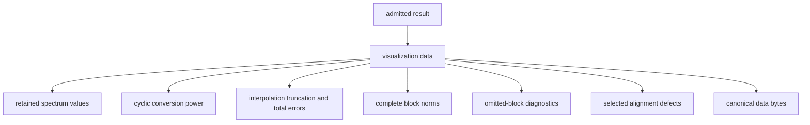

# Schematic

```mermaid
flowchart TD
    R[admitted result] --> P[visualization data]
    P --> S[retained spectrum values]
    P --> C[cyclic conversion power]
    P --> E[interpolation truncation and total errors]
    P --> H[complete block norms]
    P --> O[omitted-block diagnostics]
    P --> D[selected alignment defects]
    P --> W[canonical data bytes]
```
