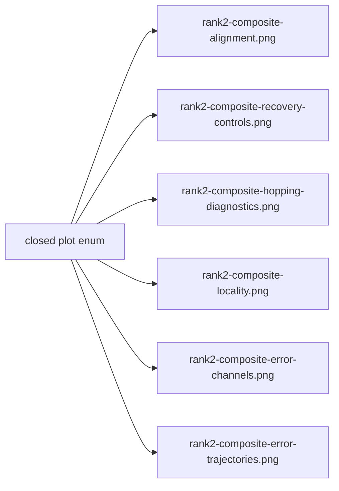

# Schematic

```mermaid
flowchart LR
    E[closed plot enum] --> A[rank2-composite-alignment.png]
    E --> R[rank2-composite-recovery-controls.png]
    E --> H[rank2-composite-hopping-diagnostics.png]
    E --> L[rank2-composite-locality.png]
    E --> C[rank2-composite-error-channels.png]
    E --> T[rank2-composite-error-trajectories.png]
```
